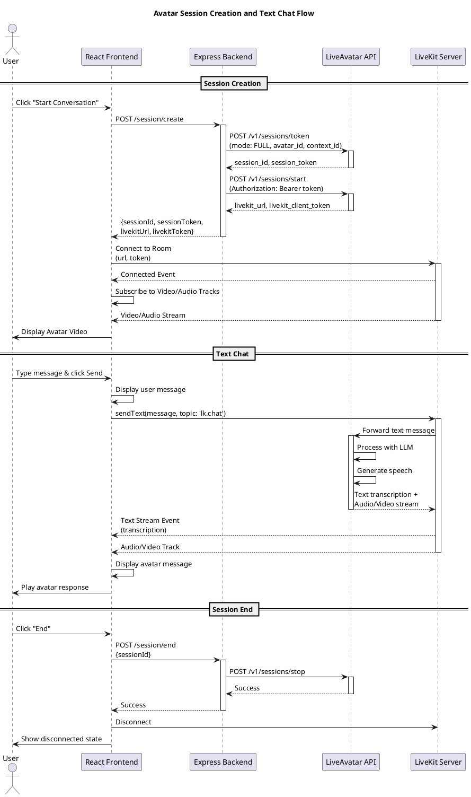
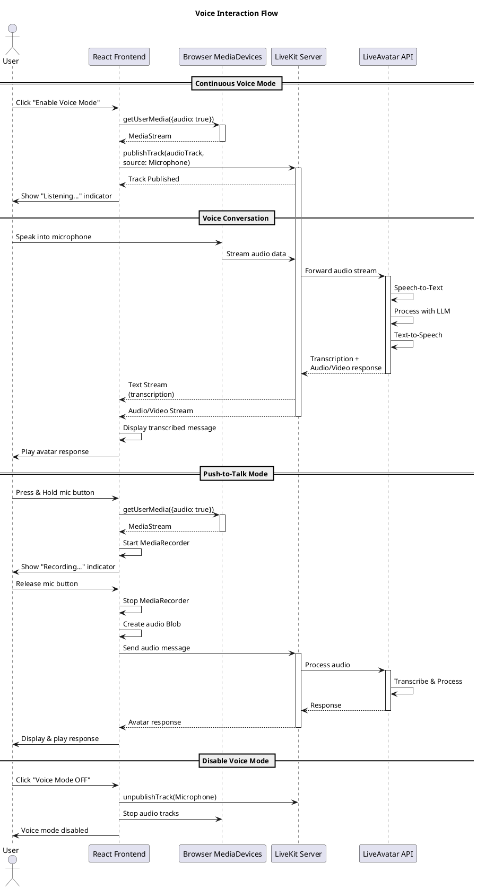
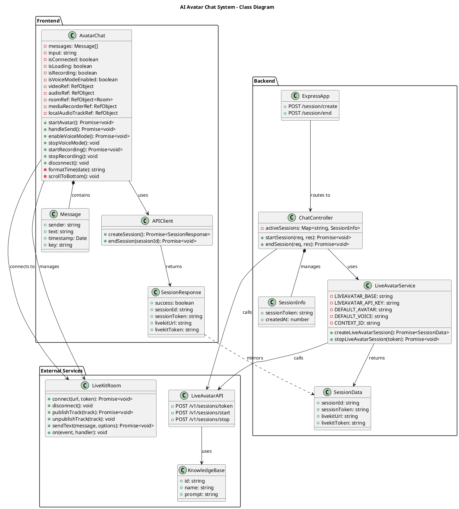
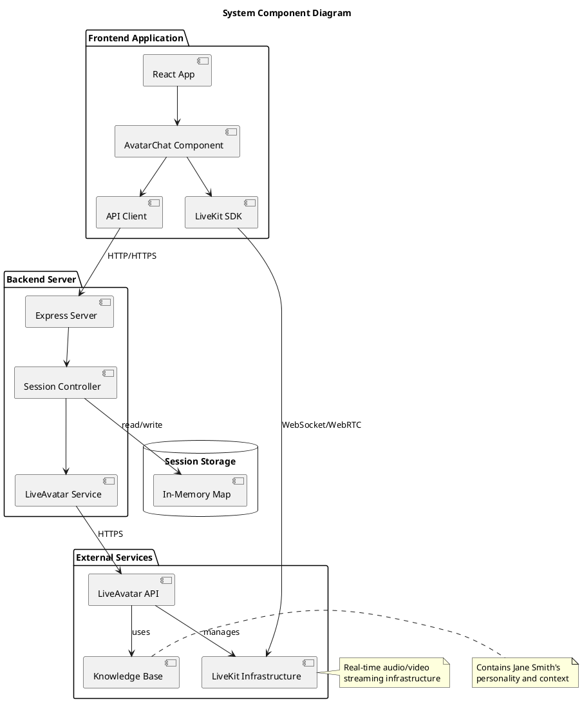
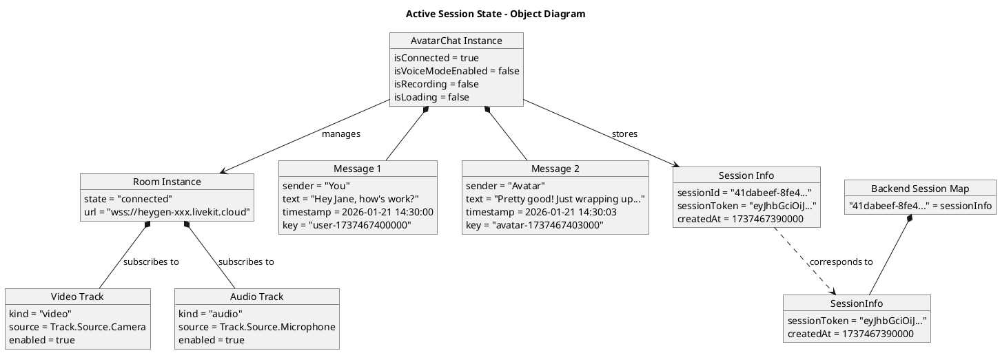
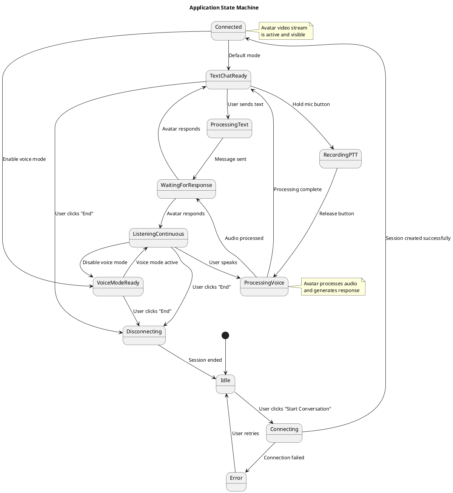

# AI Avatar Water Cooler Conversation - Complete Documentation

## Table of Contents
1. [Project Overview](#project-overview)
2. [Architecture](#architecture)
3. [Technology Stack](#technology-stack)
4. [System Components](#system-components)
5. [Setup Guide](#setup-guide)
6. [API Documentation](#api-documentation)
7. [UML Diagrams](#uml-diagrams)
8. [Features](#features)
9. [Troubleshooting](#troubleshooting)

---

## Project Overview

### Description
An interactive web application that enables users to have natural water cooler conversations with an AI-powered avatar named Jane Smith. The application supports both text and voice interactions, providing a realistic conversational experience using LiveAvatar's AI technology.

### Purpose
To create an engaging, human-like conversational interface that simulates casual workplace interactions, allowing users to practice social conversations or simply chat with a virtual colleague.

### Key Features
- Real-time AI avatar with lip-sync
- Text-based chat interface
- Voice input (Push-to-Talk and Continuous Voice Mode)
- Natural language processing
- Real-time transcription
- Responsive UI with message history

---

## Architecture

### High-Level Architecture

```
┌─────────────────────────────────────────────────────────────┐
│                        Frontend (React)                      │
│  ┌────────────────┐  ┌──────────────┐  ┌─────────────────┐ │
│  │  AvatarChat    │  │  LiveKit     │  │  Voice Input    │ │
│  │  Component     │  │  Client      │  │  Handler        │ │
│  └────────────────┘  └──────────────┘  └─────────────────┘ │
└─────────────────────────────────────────────────────────────┘
                              │
                              │ HTTPS/WebSocket
                              ▼
┌─────────────────────────────────────────────────────────────┐
│                    Backend (Node.js/Express)                 │
│  ┌────────────────┐  ┌──────────────────────────────────┐  │
│  │  Session       │  │  LiveAvatar API Client           │  │
│  │  Controller    │  │  - Session Management            │  │
│  │                │  │  - Knowledge Base Integration    │  │
│  └────────────────┘  └──────────────────────────────────┘  │
└─────────────────────────────────────────────────────────────┘
                              │
                              │ REST API
                              ▼
┌─────────────────────────────────────────────────────────────┐
│                    LiveAvatar Platform                       │
│  ┌────────────────┐  ┌──────────────┐  ┌─────────────────┐ │
│  │  AI Avatar     │  │  LLM         │  │  Speech-to-Text │ │
│  │  Engine        │  │  Processing  │  │  & TTS Engine   │ │
│  └────────────────┘  └──────────────┘  └─────────────────┘ │
└─────────────────────────────────────────────────────────────┘
```

### Communication Flow

```
User Input → Frontend → Backend → LiveAvatar API
                ↓
          LiveKit Room
                ↓
      Video/Audio Stream → Frontend Display
```

---

## Technology Stack

### Frontend
- **React** (v18+) - UI framework
- **LiveKit Client SDK** - Real-time audio/video streaming
- **JavaScript (ES6+)** - Programming language
- **CSS3** - Styling with animations
- **Vite** - Build tool and dev server

### Backend
- **Node.js** (v18+) - Runtime environment
- **Express.js** - Web framework
- **Axios** - HTTP client
- **dotenv** - Environment variable management
- **CORS** - Cross-origin resource sharing

### External Services
- **LiveAvatar API** - AI avatar platform
- **LiveKit** - WebRTC infrastructure
- **Knowledge Base** - Context for AI responses

---

## System Components

### 1. Frontend Components

#### AvatarChat Component
**Location:** `client/src/components/AvatarChat.jsx`

**Responsibilities:**
- Manage LiveKit room connection
- Handle user inputs (text and voice)
- Display video stream and chat messages
- Coordinate voice recording and streaming
- Manage UI state

**Key State Variables:**
```javascript
- messages: Array         // Chat history
- isConnected: Boolean    // Connection status
- isRecording: Boolean    // Voice recording state
- isVoiceModeEnabled: Boolean  // Continuous voice mode
- isLoading: Boolean      // Request state
- isAvatarSpeaking: Boolean    // Avatar response state
```

#### API Utilities
**Location:** `client/src/utils/api.js`

**Functions:**
- `createSession()` - Initialize avatar session
- `endSession(sessionId)` - Terminate session

### 2. Backend Components

#### Session Controller
**Location:** `server/controllers/chatController.js`

**Endpoints:**
- `POST /session/create` - Create new avatar session
- `POST /session/end` - End active session

**Functions:**
- `startSession(req, res)` - Create and start LiveAvatar session
- `endSession(req, res)` - Stop session and cleanup

#### LiveAvatar Service
**Location:** `server/services/liveAvatarService.js`

**Functions:**
- `createLiveAvatarSession()` - Create session token and start session
- `stopLiveAvatarSession(sessionToken)` - Stop active session

**Configuration:**
```javascript
- Avatar ID: 998e5637-cfca-4700-891e-8a40ce33f562
- Voice ID: Configurable (uses avatar default if not set)
- Mode: FULL (AI-powered conversation)
- Context ID: Knowledge base for personality
```

### 3. Configuration Files

#### Environment Variables (.env)
```env
# LiveAvatar Configuration
LIVEAVATAR_API_KEY=your_api_key_here
CONTEXT_ID=your_context_id_here
AVATAR_ID=998e5637-cfca-4700-891e-8a40ce33f562
VOICE_ID=optional_voice_id

# Server Configuration
PORT=5000
```

---

## Setup Guide

### Prerequisites
- Node.js 18+ installed
- npm or yarn package manager
- LiveAvatar API account
- Modern web browser with microphone access

### Installation Steps

#### 1. Clone Repository
```bash
git clone <repository-url>
cd ai-avatar-chat
```

#### 2. Backend Setup
```bash
cd server
npm install
```

#### 3. Frontend Setup
```bash
cd client
npm install
```

#### 4. Create Knowledge Base
```bash
cd server
node createContext.js
```

Copy the generated `CONTEXT_ID` to your `.env` file.

#### 5. Configure Environment Variables
Create `server/.env`:
```env
LIVEAVATAR_API_KEY=your_liveavatar_api_key
CONTEXT_ID=your_context_id_from_step_4
AVATAR_ID=998e5637-cfca-4700-891e-8a40ce33f562
PORT=5000
```

#### 6. Start Services

**Terminal 1 - Backend:**
```bash
cd server
npm start
```

**Terminal 2 - Frontend:**
```bash
cd client
npm run dev
```

#### 7. Access Application
Open browser and navigate to: `http://localhost:5173`

---

## API Documentation

### Backend Endpoints

#### 1. Create Session

**Endpoint:** `POST /session/create`

**Description:** Creates a new LiveAvatar session and returns connection credentials.

**Request:**
```http
POST /session/create
Content-Type: application/json
```

**Response:**
```json
{
  "success": true,
  "sessionId": "uuid-string",
  "sessionToken": "jwt-token-string",
  "livekitUrl": "wss://livekit-server-url",
  "livekitToken": "livekit-jwt-token"
}
```

**Error Response:**
```json
{
  "error": "Failed to create session",
  "details": "Error message"
}
```

**Status Codes:**
- `200` - Success
- `500` - Server error

#### 2. End Session

**Endpoint:** `POST /session/end`

**Description:** Terminates an active LiveAvatar session.

**Request:**
```http
POST /session/end
Content-Type: application/json

{
  "sessionId": "uuid-string"
}
```

**Response:**
```json
{
  "success": true,
  "message": "Session ended"
}
```

**Error Response:**
```json
{
  "error": "Session not found"
}
```

**Status Codes:**
- `200` - Success
- `404` - Session not found
- `500` - Server error

### LiveAvatar API Integration

#### 1. Create Session Token

**Endpoint:** `POST https://api.liveavatar.com/v1/sessions/token`

**Headers:**
```
X-API-KEY: your_api_key
Content-Type: application/json
```

**Request Body:**
```json
{
  "mode": "FULL",
  "avatar_id": "avatar-uuid",
  "avatar_persona": {
    "voice_id": "voice-uuid",
    "context_id": "context-uuid",
    "language": "en"
  }
}
```

**Response:**
```json
{
  "session_id": "uuid",
  "session_token": "jwt-token"
}
```

#### 2. Start Session

**Endpoint:** `POST https://api.liveavatar.com/v1/sessions/start`

**Headers:**
```
Authorization: Bearer {session_token}
Content-Type: application/json
```

**Response:**
```json
{
  "livekit_url": "wss://...",
  "livekit_client_token": "jwt-token"
}
```

#### 3. Stop Session

**Endpoint:** `POST https://api.liveavatar.com/v1/sessions/stop`

**Headers:**
```
Authorization: Bearer {session_token}
Content-Type: application/json
```

---

## UML Diagrams

### 1. Sequence Diagram - Session Creation and Text Chat



### 2. Sequence Diagram - Voice Interaction



### 3. Class Diagram



### 4. Component Diagram



### 5. Object Diagram - Active Session



### 6. State Diagram - Application States



---

## Features

### 1. Text Chat
- Real-time messaging with AI avatar
- Message history with timestamps
- Typing indicators
- Auto-scroll to latest message
- Message sent confirmation

### 2. Voice Interaction

#### Continuous Voice Mode
- Always-on microphone
- Real-time speech-to-text
- Natural conversation flow
- Visual indicator when listening
- One-click enable/disable

#### Push-to-Talk
- Hold button to record
- Release to send
- Visual recording feedback
- Recording status indicator
- Works alongside text input

### 3. Avatar Features
- Real-time lip-sync
- High-quality video streaming
- Natural voice synthesis
- Contextual responses based on knowledge base
- Expressive gestures and emotions

### 4. User Interface
- Clean, modern design
- Responsive layout
- Loading states and indicators
- Error handling with user feedback
- Accessible controls

---

## Technical Details

### LiveKit Integration

#### Connection Management
```javascript
// Connect to LiveKit room
const room = new Room();
await room.connect(livekitUrl, livekitToken, {
  autoSubscribe: true
});

// Subscribe to tracks
room.on(RoomEvent.TrackSubscribed, (track) => {
  if (track.kind === Track.Kind.Video) {
    videoElement.srcObject = track.attach().srcObject;
  }
});
```

#### Text Messaging
```javascript
// Send text to avatar
await room.localParticipant.sendText(message, {
  topic: 'lk.chat'
});

// Receive transcriptions
room.registerTextStreamHandler('lk.transcription', async (reader) => {
  const message = await reader.readAll();
  const isFinal = reader.info.attributes['lk.transcription_final'] === 'true';
  // Process transcription
});
```

#### Voice Streaming
```javascript
// Publish audio track
const stream = await navigator.mediaDevices.getUserMedia({ 
  audio: {
    echoCancellation: true,
    noiseSuppression: true,
    autoGainControl: true
  } 
});

await room.localParticipant.publishTrack(audioTrack, {
  source: Track.Source.Microphone
});
```

### Knowledge Base Configuration

The knowledge base defines Jane Smith's personality:

```javascript
{
  name: "Jane Smith - Water Cooler Chat",
  prompt: `You are Jane Smith, a friendly colleague having casual 
  water cooler conversations. Keep responses SHORT (1-2 sentences).
  Be natural and conversational. Reference office situations like 
  meetings, deadlines, and projects. Show genuine interest and 
  occasionally ask follow-up questions.`
}
```

### Session Management

Sessions are stored in-memory on the backend:

```javascript
const activeSessions = new Map();

// Store session
activeSessions.set(sessionId, {
  sessionToken,
  createdAt: Date.now()
});

// Retrieve session
const session = activeSessions.get(sessionId);

// Cleanup
activeSessions.delete(sessionId);
```

---

## Troubleshooting

### Common Issues

#### 1. "No credits available"
**Problem:** LiveAvatar account has run out of credits.

**Solution:**
- Check your LiveAvatar account balance at https://app.liveavatar.com/developers
- Purchase additional credits or wait for free tier reset
- Verify your subscription status

#### 2. "Voice not found"
**Problem:** Specified voice ID doesn't exist or isn't compatible.

**Solution:**
- Run `node listVoices.js` to see available voices
- Update `VOICE_ID` in `.env` or remove it to use avatar's default voice
- Ensure voice supports the selected language

#### 3. Microphone not working
**Problem:** Browser doesn't have microphone permission.

**Solution:**
- Check browser permissions (usually a camera icon in address bar)
- Ensure HTTPS connection (required for microphone access)
- Try a different browser (Chrome/Edge recommended)
- Check OS-level microphone permissions

#### 4. Avatar not responding
**Problem:** Messages sent but no avatar response.

**Solution:**
- Check network connection
- Verify LiveKit connection is active (check console logs)
- Ensure session hasn't expired
- Check backend logs for errors
- Restart the session

#### 5. Video not displaying
**Problem:** Avatar video stream not showing.

**Solution:**
- Check browser console for errors
- Verify LiveKit connection
- Ensure video element has correct srcObject
- Check if tracks are being subscribed properly
- Clear browser cache and reload

#### 6. Session creation fails
**Problem:** Backend returns error when creating session.

**Solution:**
- Verify `.env` configuration:
  - `LIVEAVATAR_API_KEY` is valid
  - `CONTEXT_ID` exists
  - `AVATAR_ID` is correct
- Check backend console for detailed errors
- Ensure LiveAvatar API is accessible
- Verify account has active subscription

### Debug Mode

Enable detailed logging:

**Frontend:**
```javascript
// In AvatarChat.jsx
console.log("Room state:", roomRef.current?.state);
console.log("Tracks:", roomRef.current?.localParticipant.tracks);
```

**Backend:**
```javascript
// In liveAvatarService.js
console.log("Request:", requestBody);
console.log("Response:", response.data);
```

### Performance Optimization

#### Reduce Latency
- Use wired internet connection
- Close unnecessary browser tabs
- Ensure sufficient CPU/memory available
- Use modern browser (latest Chrome/Edge)

#### Improve Video Quality
- Stable internet connection (10+ Mbps recommended)
- Reduce background network usage
- Check WebRTC stats in browser DevTools

---

## File Structure

```
project-root/
│
├── server/
│   ├── controllers/
│   │   └── chatController.js       # Session management endpoints
│   │
│   ├── services/
│   │   └── liveAvatarService.js    # LiveAvatar API integration
│   │
│   ├── .env                         # Environment variables
│   ├── server.js                    # Express app entry point
│   ├── createContext.js             # Knowledge base creation script
│   ├── listVoices.js               # Voice listing utility
│   └── package.json
│
├── client/
│   ├── src/
│   │   ├── components/
│   │   │   ├── AvatarChat.jsx      # Main chat component
│   │   │   └── AvatarChat.css      # Component styles
│   │   │
│   │   ├── utils/
│   │   │   └── api.js              # API client functions
│   │   │
│   │   ├── App.jsx                 # Root component
│   │   └── main.jsx                # Entry point
│   │
│   ├── public/
│   ├── package.json
│   └── vite.config.js
│
└── README.md
```

---

## Environment Variables Reference

### Server (.env)

| Variable | Required | Description | Example |
|----------|----------|-------------|---------|
| `LIVEAVATAR_API_KEY` | Yes | API key from LiveAvatar | `abc123...` |
| `CONTEXT_ID` | Yes | Knowledge base ID | `uuid-string` |
| `AVATAR_ID` | No | Specific avatar ID | `998e5637...` |
| `VOICE_ID` | No | Custom voice ID | `f7c46f14...` |
| `PORT` | No | Server port | `5000` |

---

## Best Practices

### Security
1. Never commit `.env` files
2. Use environment-specific API keys
3. Implement rate limiting in production
4. Validate all user inputs
5. Use HTTPS in production

### Performance
1. Implement session cleanup for inactive sessions
2. Use connection pooling for API requests
3. Implement proper error boundaries
4. Optimize bundle size
5. Use lazy loading where appropriate

### Code Quality
1. Follow ESLint rules
2. Write meaningful comments
3. Use TypeScript for type safety (optional enhancement)
4. Implement proper error handling
5. Write unit tests for critical functions

---

## Future Enhancements

### Potential Features
1. **Multi-language Support** - Support for languages other than English
2. **Custom Avatars** - Allow users to select different avatars
3. **Conversation History** - Persist chat history across sessions
4. **Screen Sharing** - Share screen during conversation
5. **Group Conversations** - Multiple users chatting with avatar
6. **Sentiment Analysis** - Detect user emotions and adjust responses
7. **Voice Cloning** - Use custom voice models
8. **Mobile App** - Native iOS/Android applications
9. **Analytics Dashboard** - Track usage and conversation metrics
10. **WebRTC Recording** - Record conversations for playback

### Technical Improvements
1. Migrate to TypeScript
2. Add comprehensive unit and integration tests
3. Implement Redis for session management
4. Add database for conversation persistence
5. Implement CI/CD pipeline
6. Add monitoring and logging (e.g., Sentry)
7. Implement caching strategy
8. Add load balancing for scale
9. Implement WebSocket fallback
10. Add progressive web app (PWA) features

---

## Credits

### Technologies Used
- **LiveAvatar** - AI avatar platform
- **LiveKit** - Real-time communication infrastructure
- **React** - Frontend framework
- **Express.js** - Backend framework
- **Node.js** - Runtime environment

### Documentation
- LiveAvatar API Documentation: https://docs.liveavatar.com
- LiveKit Documentation:
